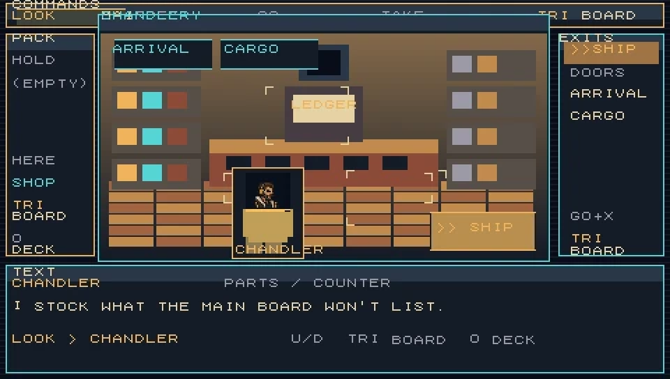
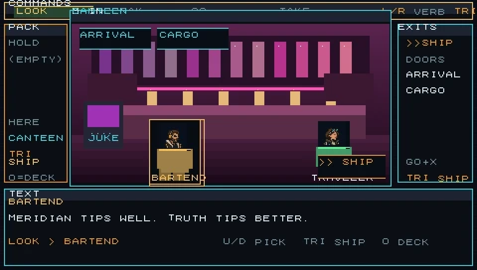
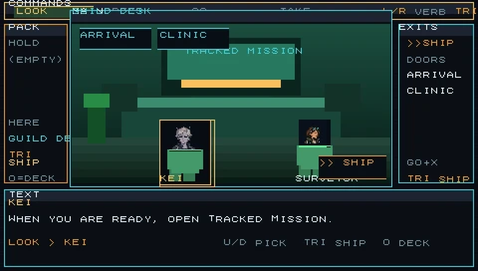

<p align="center">
  
</p>

<p align="center">
  <a href="https://github.com/roodmilk/elite-next-psp/releases/latest">
    
  </a>
  &nbsp;
  <a href="https://github.com/roodmilk/elite-next-psp/releases/latest">
    
  </a>
  &nbsp;
  
</p>

<p align="center">
  <strong>Trade. Explore. Bring someone home.</strong><br>
  Native PSP homebrew inspired by Elite-A — a 256-system galaxy, flight &amp; combat,<br>
  cinematic MacVenture station decks, planetary landings, custom radio, and The Open Channel.
</p>

<p align="center">
  <a href="https://github.com/roodmilk/elite-next-psp/releases/latest"><strong>⬇ Get the game (Releases)</strong></a>
  ·
  <a href="#install">Install</a>
  ·
  <a href="#screenshots">Screenshots</a>
  ·
  <a href="#controls">Controls</a>
</p>

---

## Download

Go to **[Releases → Latest](https://github.com/roodmilk/elite-next-psp/releases/latest)** and grab:

| File | Take this if… |
| --- | --- |
| **`ELITE-NEXT-PSP-v*.zip`** | You are installing for the first time (**recommended**) |
| **`EBOOT.PBP`** | You already have the folder and only need to update the executable |

That is the playable build. You do not need to compile anything to play.

---

## Install

<a id="install"></a>

### PPSSPP (PC, phone, tablet)

1. Install **[PPSSPP](https://www.ppsspp.org/)**.
2. Unzip the release so the folder contains `EBOOT.PBP`.
3. In PPSSPP: **Games → Load file…** → open `EBOOT.PBP`.
4. Use **480×272** or an integer scale (2× / 3×) so the UI stays sharp.

### Real PSP

1. Unzip the release.
2. Copy the whole folder to the Memory Stick as:

   ```text
   ms0:/PSP/GAME/ELITE-NEXT/
   ```

   (`EBOOT.PBP` must sit directly inside that folder.)
3. Launch **ELITE: NEXT** from the Game menu (homebrew-capable firmware).

### Optional music

Drop your own MP3s into the station folders next to the EBOOT. The game shuffles them on startup:

```text
music/
  Deep Field/
  Neon Transit/
  Pixel Comet/
  Velvet Orbit/
  Far Horizons/
```

No tracks are bundled — bring music you have rights to. Restart after adding or removing files.

---

## Screenshots

<a id="screenshots"></a>

<p align="center">
  
</p>

<p align="center">
  
  &nbsp;
  
</p>

<p align="center">
  
  &nbsp;
  
</p>

<p align="center">
  
  &nbsp;
  
</p>

---

## What you get

| | |
| --- | --- |
| **Open galaxy** | 256 seeded systems — hubs, relays, markets, danger, multi-jump routes |
| **The Open Channel** | Original Kei &amp; Ryn campaign — beat-based dialogue, tracked missions, lasting choices |
| **Flight &amp; combat** | Targeting computer, missiles, police, freighters, mining belts |
| **Station decks** | MacVenture rooms with hero focal props, LOOK / SPEAK / GO / TAKE, clear SHIP return |
| **Worlds** | Planetary approach, EVA walks, landing pads |
| **Commander life** | Missions, GalNet, SpaceBook, outfitting, wanted levels, save/load |
| **Radio** | Five custom stations + procedural fallback when a folder is empty |

---

## Controls

| Input | Action |
| --- | --- |
| **Nub / D-pad** | Steer |
| **L / R** | Throttle · **double-tap R** boost |
| **L + Left/Right** | Roll |
| **Cross (X)** | Fire / confirm / act |
| **Square** | Targeting computer · hold + D-pad browse contacts |
| **Circle** | Planet approach / land / walk · cancel / deck |
| **Triangle** | Comms / OK · hold for quick menu · board ship from station |
| **Select** | Command deck |
| **Start** | Pause |

Galaxy Map: **Triangle** toggles the full 256-system overview · **L/R** zoom · **Cross** plots a multi-jump route.

---

## Status

Active homebrew. Playable packages publish on every version tag under [Releases](https://github.com/roodmilk/elite-next-psp/releases). Emulator regressions run in development; physical PSP testing is still recommended for audio suspend/resume and Memory Stick behaviour.

---

## Build from source

```powershell
./build.ps1 -Toolchain C:/path/to/pspdev
./smoke-test.ps1
```

Contributor workflow: [`AGENTS.md`](AGENTS.md) · handoff: [`CLAUDE-HANDOFF.md`](CLAUDE-HANDOFF.md).

---

## Docs

| Doc | What it is |
| --- | --- |
| [`docs/GITHUB-STOREFRONT.md`](docs/GITHUB-STOREFRONT.md) | Repo face / post-merge checklist |
| [`CLAUDE-HANDOFF.md`](CLAUDE-HANDOFF.md) | Current implementation state |
| [`docs/DESIGN-BIBLE-2.0.md`](docs/DESIGN-BIBLE-2.0.md) | Product &amp; technical direction |
| [`docs/OPEN-CHANNEL-CAMPAIGN.md`](docs/OPEN-CHANNEL-CAMPAIGN.md) | Campaign bible |
| [`docs/FEATURE-MAP.md`](docs/FEATURE-MAP.md) | Feature inventory |
| [`CHANGELOG.md`](CHANGELOG.md) | Notable release notes |
| [`docs/DEVELOPMENT-HISTORY.md`](docs/DEVELOPMENT-HISTORY.md) | Full version-by-version log |

---

## Credits & lineage

Original *Elite*: Ian Bell and David Braben (Acornsoft, 1984). Elite-A additions: Angus Duggan. Documented source: [Mark Moxon](https://github.com/markmoxon/elite-a-source-code-bbc-micro) / [elite.bbcelite.com](https://elite.bbcelite.com/elite-a/). Original rights remain with their owners; this project does not relicense that material.

Built with [PSPSDK](https://github.com/pspdev/pspsdk). Play with [PPSSPP](https://github.com/hrydgard/ppsspp).

<p align="center">
  <br>
  <em>A signal worth following.</em><br>
  <a href="https://github.com/roodmilk/elite-next-psp/releases/latest"><strong>⬇ Download latest</strong></a>
</p>
