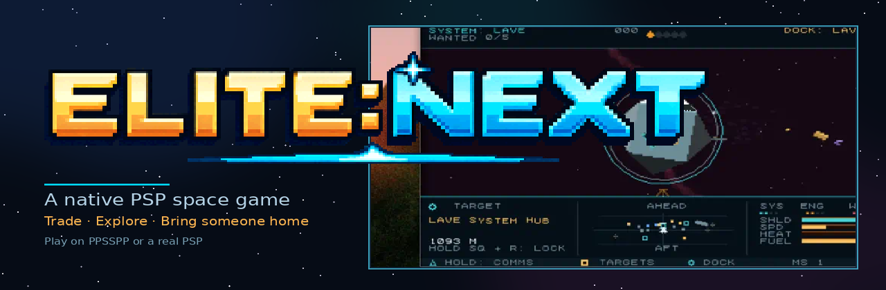
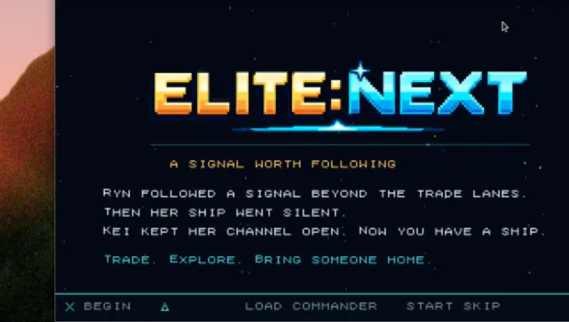
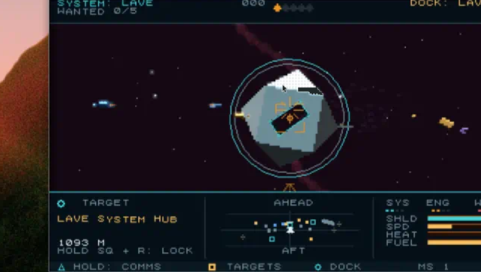
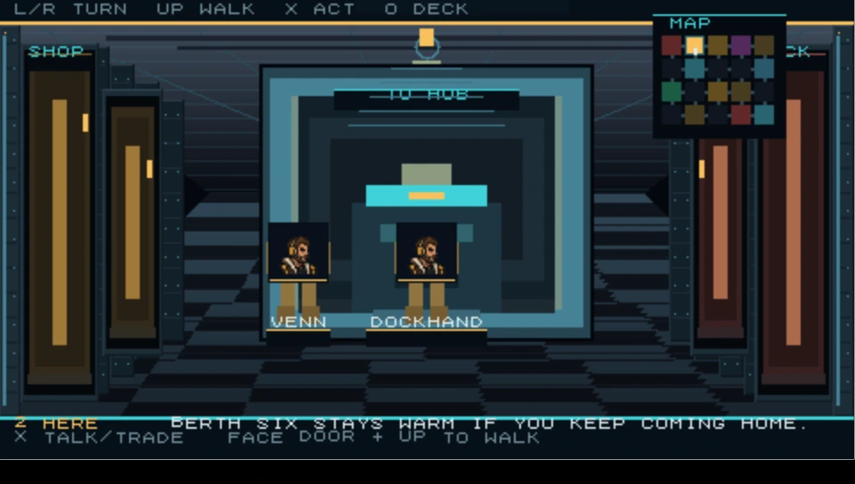
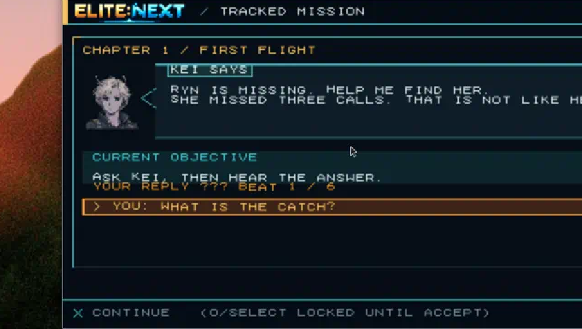
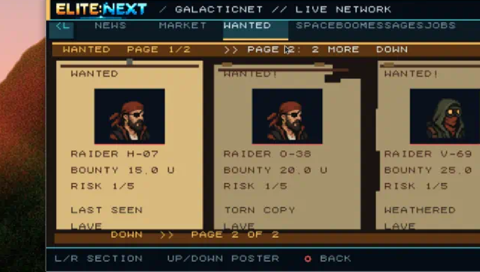

<p align="center">
  
</p>

<p align="center">
  <strong>Trade. Explore. Bring someone home.</strong><br>
  A native PSP homebrew space game inspired by Elite-A — 256 systems, missions, planetary landings,<br>
  station decks, custom radio, and an original campaign with Kei and Ryn.
</p>

<p align="center">
  <a href="https://github.com/roodmilk/elite-next-psp/releases/latest"></a>
  <a href="https://github.com/roodmilk/elite-next-psp/releases/latest"></a>
  
  
</p>

<p align="center">
  <a href="https://github.com/roodmilk/elite-next-psp/releases/latest"><strong>⬇ Download the latest build</strong></a>
  ·
  <a href="#play-in-5-minutes">Play in 5 minutes</a>
  ·
  <a href="#what-you-get">What you get</a>
  ·
  <a href="#controls">Controls</a>
</p>

---

## Play in 5 minutes

### 1. Grab the release

From the **[latest Release](https://github.com/roodmilk/elite-next-psp/releases/latest)** download either:

| File | Use this when |
| --- | --- |
| **`ELITE-NEXT-PSP-v*.zip`** | You want the full game folder (recommended) |
| **`EBOOT.PBP`** | You already have a game folder and only need to replace the executable |

### 2. Install

**PPSSPP (PC / phone / tablet)**  
1. Install [PPSSPP](https://www.ppsspp.org/).  
2. Unzip the release so you have a folder containing `EBOOT.PBP`.  
3. In PPSSPP: **Games → Load** → open that `EBOOT.PBP`.  
4. Prefer a **480×272** (or integer multiple) window so the UI stays sharp.

**Real PSP**  
1. Copy the unzipped folder to `ms0:/PSP/GAME/ELITE-NEXT/` (Memory Stick).  
2. Launch **ELITE: NEXT** from the PSP Game menu (homebrew-capable firmware required).

### 3. Optional: your music

Drop your own MP3s into the station folders next to the EBOOT — the game shuffles them on startup:

```text
music/
  Deep Field/
  Neon Transit/
  Pixel Comet/
  Velvet Orbit/
  Far Horizons/
```

No tracks ship in the zip; folders are empty on purpose so you can bring music you have rights to.

---

## What you get

<p align="center">
  
</p>

| | |
| --- | --- |
| **Open galaxy** | 256 seeded systems with hubs, relays, markets, danger ratings and warp routes |
| **The Open Channel** | Original Kei & Ryn campaign — travel, survey, salvage, conflict, lasting choices |
| **Flight & combat** | Targeting computer, missiles, police, freighters, mining belts |
| **Worlds & decks** | Planetary approach, EVA walks, first-person station crawl with shops and NPCs |
| **Commander life** | Missions, GalNet, SpaceBook, outfitting, wanted levels, save/load |
| **Radio** | Five custom stations + procedural fallback when a folder is empty |

<p align="center">
  
  &nbsp;
  
</p>
<p align="center">
  
  &nbsp;
  
</p>

---

## Controls

| Input | Action |
| --- | --- |
| **Nub / D-pad** | Steer |
| **L / R** | Throttle · **double-tap R** to boost |
| **L + Left/Right** | Roll |
| **Cross (X)** | Fire laser · confirm |
| **Square** | Targeting computer · hold + D-pad to browse contacts |
| **Circle** | Planet approach / land / walk · cancel |
| **Triangle** | Comms / OK speech · hold for quick menu |
| **Select** | Command deck |
| **Start** | Pause |

Galaxy Map: **Triangle** toggles the full 256-system overview · **L/R** zoom · **Cross** plots a multi-jump route.

More detail lives in [`CLAUDE-HANDOFF.md`](CLAUDE-HANDOFF.md) and [`docs/UI-SPEC.md`](docs/UI-SPEC.md).

---

## Status

ELITE: NEXT is an **active homebrew** build. Recent tagged packages are published automatically on GitHub Releases. Emulator regression suites are run during development; physical PSP testing is still recommended for audio suspend/resume and Memory Stick behaviour.

---

## Build from source

```powershell
./build.ps1 -Toolchain C:/path/to/pspdev
./smoke-test.ps1
```

Default Windows toolchain layout is documented in [`CLAUDE-HANDOFF.md`](CLAUDE-HANDOFF.md). Regenerating ship geometry (optional):

```bash
node tools/extract-ships.mjs
```

Contributor workflow: [`AGENTS.md`](AGENTS.md).

---

## Docs

| Doc | What it is |
| --- | --- |
| [`CLAUDE-HANDOFF.md`](CLAUDE-HANDOFF.md) | Current implementation state |
| [`docs/DESIGN-BIBLE-2.0.md`](docs/DESIGN-BIBLE-2.0.md) | Product & technical direction |
| [`docs/OPEN-CHANNEL-CAMPAIGN.md`](docs/OPEN-CHANNEL-CAMPAIGN.md) | 24-chapter campaign bible |
| [`docs/FEATURE-MAP.md`](docs/FEATURE-MAP.md) | Feature inventory |
| [`CHANGELOG.md`](CHANGELOG.md) | Notable release notes |
| [`docs/DEVELOPMENT-HISTORY.md`](docs/DEVELOPMENT-HISTORY.md) | Full version-by-version development log |

---

## Credits & lineage

Original *Elite*: Ian Bell and David Braben (Acornsoft, 1984). Elite-A additions: Angus Duggan. Documented source: [Mark Moxon](https://github.com/markmoxon/elite-a-source-code-bbc-micro) / [elite.bbcelite.com](https://elite.bbcelite.com/elite-a/). Original rights remain with their owners; this project does not relicense that material.

Built with [PSPSDK](https://github.com/pspdev/pspsdk). Play with [PPSSPP](https://github.com/hrydgard/ppsspp).

<p align="center">
  <br>
  <em>A signal worth following.</em>
</p>
